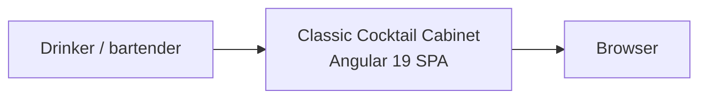
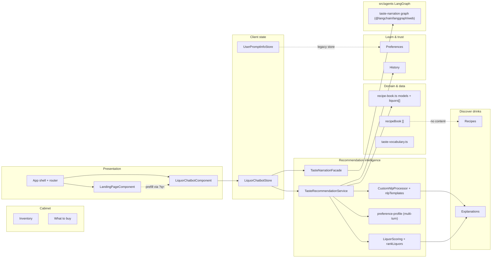
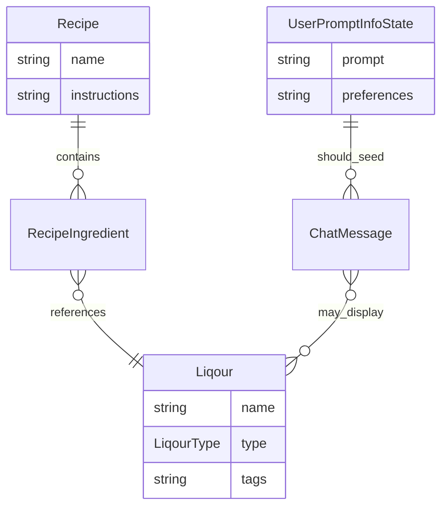
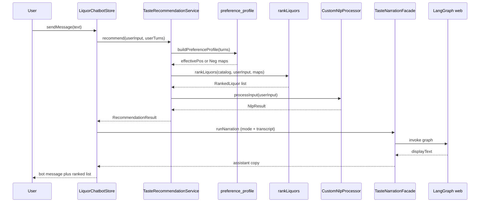

# Classic Cocktail Cabinet — Architecture Document

## Purpose of this document

This document describes **systems** and **data as entities** so the team can reason about **direction** (recipe/cabinet vs liquor assistant) without re-reading the whole codebase. It includes an **architecture map** tying current modules to **value streams** defined in [PRODUCT.md](./PRODUCT.md).

---

## System context (lightweight)

**Boundary:** All logic today runs **client-side**. There is no backend service, API, or database in this repository.

---

## LangGraph orchestration (target)

Longer term, **multi-step** flows (memory, narration, tool-style calls to deterministic rankers, optional WebLLM) fit **LangGraph** better than ad-hoc `async` chains in Angular services: explicit **state**, **nodes** as (mostly) pure functions, and **edges** for control flow.

**Intended split:**

| Layer | Responsibility |
|-------|----------------|
| **`src/agents/`** | LangGraph graph definitions, node functions, graph state types, model **provider adapters** (WebLLM, HTTP to Ollama, mocks). **No** `@angular/*`, **no** Angular DI. |
| **`src/lib/`** (optional) | **Pure** TypeScript shared by agents and the app (e.g. scoring math, normalization)—no framework. |
| **`src/app/`** | UI, routing, stores; a **thin facade** (`@Injectable`) that maps UI ↔ agent input/output and calls a single exported `run*Graph(...)` entrypoint. |

Deterministic ranking (catalog, scores) should remain **callable as a tool** from a graph node, not reimplemented inside an LLM. Optional generative steps only **paraphrase** or **route**; they do not own source-of-truth scores.

**Style and boundary rules** (Angular vs agentic code, DI vs pure state): see [docs/AGENT_ANGULAR_STYLE_GUIDE.md](./docs/AGENT_ANGULAR_STYLE_GUIDE.md).

---

## Architecture map: structures vs value streams

Legend: **solid** = implemented and on the critical path; **dashed** = partial or disconnected; **gray** = dead or unused for user outcomes.

### How structures *should* support value streams (target alignment)

| Value stream | Supporting entities / systems | Today | Healthy target |
|--------------|-------------------------------|-------|----------------|
| Discover drinks | `Recipe`, `RecipeIngredient`, `Liqour`, recipe search | `recipeBook` empty; chat returns bottles not drinks | Either populate recipes and a matcher, or **remove recipe claims** from product |
| Cabinet | `UserCabinet`, `OwnedBottle` → join to `Liqour` | None | New store + persistence strategy; landing “adventure” becomes **structured intake** |
| Learn & trust | `UserPromptInfo`, session memory, transparent rationale | `UserPromptInfoStore` isolated; agent memory not user-visible | Single **session profile** feeding both landing and chat; surface “why” from `NlpResult` + scores consistently |

---

## Entity catalog: data

Entities are **types or constants that represent domain state**, independent of UI.

| Entity | Location | Role | Lifecycle |
|--------|----------|------|-----------|
| **Liqour** | `src/app/models/recipe-book.ts` | Canonical bottle in catalog: `name`, `type`, `tags` | Static at build time |
| **LiqourType** | same | Enum coarse category (AMARO, WHISKEY, SPIRIT, LIQUEUR, BITTERS) | Static |
| **liquors** | same | Full recommendation universe (~50+ entries) | Static |
| **Recipe** | same | Intended: name, ingredients, instructions, tags | **Not instantiated** — `recipeBook` is `[]` |
| **RecipeIngredient** | same | Links amount/unit to a `Liqour` | Unused until recipes exist |
| **Garnish** | same | Declared; unused in flows | Dormant |
| **tasteTags** | `taste-vocabulary.ts` (re-exported from `nlp-templates.ts`) | Synonym → flavor family maps | Single source for scoring + NLP |
| **ChatMessage** | `src/app/models/chat-types.ts` | Transcript slice: text, optional `recommendations`, `reasoning`, `confidence` | Ephemeral (in memory until refresh) |
| **UserPromptInfoState** | `user-prompt-info.store.ts` | `prompt`, `preferences[]` | Legacy; landing handoff uses **router `?q=`** into chat |
| **RecommendationResult** | `taste-recommendation.service.ts` | Ranked liquors + NLP copy + optional `rankedMeta` | Per request |

### Entity relationship (logical)

**Note:** `UserPromptInfoState` is not related in code to `ChatMessage`; the diagram shows the *desired* relationship for a coherent product loop.

---

## Entity catalog: systems (runnable boundaries)

| System | Type | Responsibility | Upstream | Downstream |
|--------|------|----------------|----------|--------------|
| **Router** | Angular `Routes` | `/` → `welcome`, `/liquor-recommendations` → chat | URL | Components |
| **LandingPageComponent** | Standalone component | PRD-focused copy; taste starters; navigates to chat with `?q=` | User | `Router` |
| **LiquorChatbotComponent** | Standalone component | Chat layout, scroll; reads `q` query then clears URL | User | `LiquorChatbotStore`, `ActivatedRoute` |
| **LiquorChatbotStore** | `@ngrx/signals` store | Messages, loading; invokes taste + optional narration graph | Component | `TasteRecommendationService`, `TasteNarrationFacade` |
| **UserPromptInfoStore** | `@ngrx/signals` store | Legacy prompt store | — | Optional removal |
| **TasteRecommendationService** | `providedIn: 'root'` | Orchestrates scoring + `preference-profile` + NLP on **raw user text** | Chat store | `liquors`, `CustomNlpProcessor` |
| **LiquorScoringService** / `rankLiquors` | Pure + injectable wrapper | Deterministic tag scores, threshold, tie-break | Taste service | `RankedLiquor[]` |
| **CustomNlpProcessor** | Class | Template match + extractors → `NlpResult` | **User utterance** (via `TasteRecommendationService`) | Response copy + confidence |
| **nlpTemplates** | Config array | Regex / substring patterns, confidence, canned responses | `taste-vocabulary` | `NlpResult` |
| **TasteNarrationFacade** | `providedIn: 'root'` | Maps chat DTOs → `runTasteNarrationGraph`; optional WebLLM via `src/agents/providers` | `LiquorChatbotStore` | `@langchain/langgraph/web`, `WebLlmBrowserProvider` (`@mlc-ai/web-llm`) |
| **LangGraph narration** | `src/agents/graphs/` | `StateGraph` nodes: pack → narrate → validate catalog; **no Angular** | `TasteNarrationFacade` | WebLLM port, pure guards |

---

## Critical path sequence (today)

---

## Architectural risks and mismatches

1. **Recipe domain without recipe behavior.** Types suggest a future recipe engine, but **no service** reads `recipeBook` or builds a graph. Product copy should stay aligned with the **taste-keyword PRD** unless recipes ship.

2. **WebLLM narration** depends on WebGPU and model download from MLC’s CDN; the chat store surfaces generation errors without substituting the old NLP draft as the assistant voice.

3. **LangGraph in the browser** uses **`@langchain/langgraph/web`** so esbuild never pulls Node’s `async_hooks`. Deterministic ranking stays in `TasteRecommendationService`; the graph only narrates / validates text against the catalog.

---

## Dependency facts (npm)

- **Angular 19** + **Angular Material** + **Tailwind** (utility classes in templates).
- **@ngrx/signals** for stores.
- **`@langchain/langgraph`** is bundled for narration only from the **`@langchain/langgraph/web`** entry (browser-safe). See [docs/AGENT_ANGULAR_STYLE_GUIDE.md](./docs/AGENT_ANGULAR_STYLE_GUIDE.md) (“Browser vs Node LangGraph”).
- **`@mlc-ai/web-llm`** is bundled from npm behind a **lazy `import()`** (`WebLlmBrowserProvider`). Emscripten still references Node’s **`url`** module for a dead branch; esbuild resolves it by depending on the **`url`**, **`buffer`**, and **`process`** polyfill packages (same pattern other browser apps use with this library).

---

## Suggested architecture evolution by product direction

These are **structural** consequences; see [PRODUCT.md](./PRODUCT.md) for the product choice.

### If choosing recipe-led cabinet (Direction A)

- Introduce **RecipeRepository** (static JSON or CMS later) as single source of truth; migrate `recipeBook` off empty constant.
- Add **CabinetStore** with `ownedLiquorIds[]` and persistence (localStorage minimum).
- Add **RecipeMatcher** service: given cabinet → filter `Recipe` by ingredient coverage; optional “missing one bottle” expansion.
- **Demote or repurpose** chat to “ask about this recipe” secondary mode.

### If choosing liquor discovery assistant (Direction B)

- **Done (baseline):** `TasteRecommendationService` scores on **raw `userInput`**; `preference-profile` supplies multi-turn weights; vocabulary lives in **`taste-vocabulary.ts`**.
- **Next:** introduce **`src/agents/`** LangGraph for richer orchestration; Angular keeps a **single facade** per [docs/AGENT_ANGULAR_STYLE_GUIDE.md](./docs/AGENT_ANGULAR_STYLE_GUIDE.md).
- **Cleanup:** remove or repurpose **UserPromptInfoStore** if unused; keep landing → chat handoff via **`?q=`**.
- Remove or archive unused **Recipe** types until scope returns, **or** gate them behind a `/labs` flag to avoid false expectations.

---

## File index (quick navigation)

| Area | Path |
|------|------|
| Routes | `src/app/app.routes.ts` |
| Models + liquor catalog | `src/app/models/recipe-book.ts` |
| Chat UI | `src/app/components/liquor-chatbot/` |
| Taste recommendation (deterministic) | `src/app/core-services/taste-recommendation.service.ts`, `liquor-scoring.ts`, `taste-vocabulary.ts` |
| Preference / multi-turn | `src/app/core-services/preference-profile.ts` |
| NLP rules | `src/app/core-services/nlp-templates.ts`, `custom-nlp-processor.ts` |
| Optional browser narration | `src/app/core-services/taste-narration.facade.ts`, `src/agents/graphs/taste-narration.graph.ts`, `src/agents/providers/` |
| Landing | `src/app/landing-page/` |
| Global prompt state | `src/app/stores/user-prompt-info.store.ts` |
| Agent / LangGraph (planned) | `src/agents/` — see [docs/AGENT_ANGULAR_STYLE_GUIDE.md](./docs/AGENT_ANGULAR_STYLE_GUIDE.md) |
| Angular vs agent style guide | [docs/AGENT_ANGULAR_STYLE_GUIDE.md](./docs/AGENT_ANGULAR_STYLE_GUIDE.md) |
