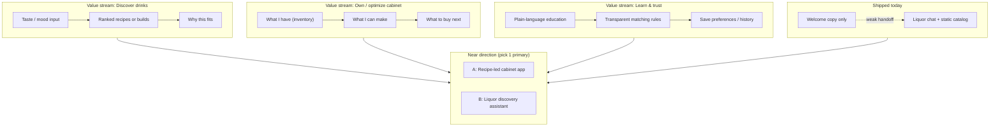

# Classic Cocktail Cabinet — Product Document

## Purpose of this document

This file aligns **what the product claims to do**, **what the codebase actually delivers**, and **where to invest next**. It is meant to resolve the current lack of focus between “cocktail cabinet / recipes” messaging and “liquor chatbot” implementation.

---

## Elevator pitch (as implemented today)

An Angular 19 single-page app with a welcome screen and a **liquor recommendation chat** that matches free-text input against a **static in-browser catalog** of spirits and liqueurs using a **custom embedding + in-memory vector search** pipeline, plus **rule-based NLP templates** for canned explanations.

---

## Stated value proposition (from UX copy)

The landing page tells users the product will help them:

1. **Stock a cocktail cabinet** — curate what to buy or keep on hand.
2. **Discover recipes from what they already have** — inventory-driven recipe discovery.

Neither path is fully implemented: there is **no recipe content**, **no cabinet/inventory model**, and **no journey** from the landing prompt into the chat experience.

---

## Target users (hypothesis)

| Persona | Job to be done |
|--------|----------------|
| Home bartender | “I want a short list of bottles or drinks that fit my taste tonight.” |
| Curious drinker | “Explain what I might like and why, without reading a textbook.” |
| Cabinet optimizer | “Given what I own, what can I make or what am I one bottle away from?” |

Today the app primarily serves the **first persona partially** (bottle suggestions only, no drinks).

---

## Current product surface

| Surface | Route | What it does |
|--------|-------|----------------|
| Welcome / “adventure” | `/welcome` | Copy + text field + chips. On Enter, stores text in `UserPromptInfoStore` only. **No link** to recommendations or recipes. |
| Liquor recommendations | `/liquor-recommendations` | Chat UI; calls recommendation agent; shows suggested `Liqour` rows and NLP-derived copy. |

Global chrome: header nav between Home and Liquor Recommendations.

---

## Honest capability matrix

| Capability | Claimed (copy / name) | Delivered | Gap severity |
|------------|------------------------|-----------|--------------|
| Classic cocktails | Implied by product name | No recipe dataset; `recipeBook` is empty | **Critical** |
| Recipe discovery from inventory | Landing copy | No inventory entity, no recipes | **Critical** |
| Cabinet stocking guidance | Landing copy | Partial: can suggest bottles from taste text only | **High** |
| Conversational continuity | Chat UX + LangChain `BufferMemory` | Memory exists but **NLP runs on formatted prompt text**, not cleanly on user turns; landing input never seeds chat | **High** |
| Personalized “adventure” | Chips + placeholder | Chips only fill the input; preferences store field unused | **Medium** |

---

## Strategic tension (root cause of “unfocused”)

Two different products are competing in one repo:

1. **Cocktail cabinet + recipes** — structured data (recipes, ingredients, user cabinet), browse/search flows, possibly educational content.
2. **Taste-first liquor recommender** — embeddings, vector similarity, chat, small curated SKU list.

The **data model** (`Recipe`, `recipeBook`, `Liqour`, `liquors`) supports (1), but **runtime value** is almost entirely (2). Marketing and navigation still speak to (1).

---

## Product map: value streams and future direction

Value streams describe **outcomes users pay attention to**. Direction choices below are **sequencing recommendations**, not commitments.

### Direction A — Recipe-led classic cabinet (matches name + landing)

- **Anchor outcome:** “From my bottles → recipes I can make.”
- **Requires:** Non-empty `recipeBook` (or external source), ingredient graph linking `RecipeIngredient` to `Liqour`, optional `UserCabinet` entity, UX for browse + filter + “make tonight.”
- **Keeps:** Material + Angular shell; may **demote** heavy chat in favor of structured flows.

### Direction B — Liquor discovery assistant (matches most code)

- **Anchor outcome:** “Describe a vibe → shortlist of bottles + rationale.”
- **Requires:** Tight landing → chat handoff, fix NLP input wiring, optional persistence; recipes become **out of scope** or a later phase.
- **Keeps:** Vector + template stack; rename product copy to avoid “cabinet/recipes” false promise.

### Recommended sequencing (product)

1. **Declare a primary direction** (A or B) in writing; defer the other to a later milestone.
2. **Close the landing → core loop** in one click: pass prompt (and optional chips as structured preferences) into the experience that actually runs the engine.
3. **Backfill the missing entity** for the chosen direction: **recipes + cabinet** for A, or **preference profile + explanation quality** for B.
4. **Measure one north-star metric** per stream (e.g., time-to-first-useful-suggestion, % sessions with saved cabinet, recipe views).

---

## Out of scope (until direction is explicit)

- Multi-user accounts, sync, and commerce integrations.
- Real LLM API calls (LangChain is used for orchestration and memory; embeddings are **custom deterministic**, not remote models).
- Mobile-native apps (web-first is fine).

---

## Glossary

| Term | Meaning in this repo |
|------|----------------------|
| Cabinet | *Conceptual only today* — not modeled in data or UI beyond copy. |
| Recipe book | `recipeBook` array; **empty**; types exist for future content. |
| Liquor catalog | `liquors` in `recipe-book.ts` — the live recommendation universe. |
| Recommendation agent | `LiquorRecommendationAgentChainService` — vector search + NLP template output. |

---

## Related document

See [ARCHITECTURE.md](./ARCHITECTURE.md) for systems, data entities, and how structure should support the value streams above.
