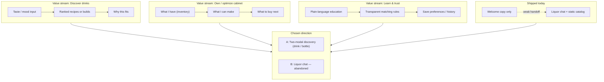

# Classic Cocktail Cabinet — Product Document

## Purpose of this document

This file aligns **what the product claims to do**, **what the codebase actually delivers**, and **where to invest next**. It is meant to resolve the current lack of focus between “cocktail cabinet / recipes” messaging and “liquor chatbot” implementation.

**Chosen direction (2026-08):** Direction B (liquor discovery chatbot) is **abandoned**. Investment is **Direction A**, specified as a basic two-modal discovery system in [prds/PRODUCT-BRIEF-two-modal-discovery.md](./prds/PRODUCT-BRIEF-two-modal-discovery.md).

---

## Elevator pitch (as implemented today)

An Angular 19 single-page app with a welcome screen and a **liquor recommendation chat** that matches free-text input against a **static in-browser catalog** of spirits and liqueurs using a **custom embedding + in-memory vector search** pipeline, plus **rule-based NLP templates** for canned explanations.

---

## Stated value proposition (from UX copy)

The landing page tells users the product will help them:

1. **Stock a cocktail cabinet** — curate what to buy or keep on hand.
2. **Discover recipes from what they already have** — inventory-driven recipe discovery.

Neither path is fully implemented: there is **no recipe content**, **no cabinet/inventory model**, and **no journey** from the landing prompt into the chat experience.

---

## Target users (hypothesis)

| Persona | Job to be done |
|--------|----------------|
| Home bartender | “I want a short list of bottles or drinks that fit my taste tonight.” |
| Curious drinker | “Explain what I might like and why, without reading a textbook.” |
| Cabinet optimizer | “Given what I own, what can I make or what am I one bottle away from?” |

Today the app primarily serves the **first persona partially** (bottle suggestions only, no drinks).

---

## Current product surface

| Surface | Route | What it does |
|--------|-------|----------------|
| Welcome / “adventure” | `/welcome` | Copy + text field + chips. On Enter, stores text in `UserPromptInfoStore` only. **No link** to recommendations or recipes. |
| Liquor recommendations | `/liquor-recommendations` | Chat UI; calls recommendation agent; shows suggested `Liqour` rows and NLP-derived copy. |

Global chrome: header nav between Home and Liquor Recommendations.

---

## Honest capability matrix

| Capability | Claimed (copy / name) | Delivered | Gap severity |
|------------|------------------------|-----------|--------------|
| Classic cocktails | Implied by product name | No recipe dataset; `recipeBook` is empty | **Critical** |
| Recipe discovery from inventory | Landing copy | No inventory entity, no recipes | **Critical** |
| Cabinet stocking guidance | Landing copy | Partial: can suggest bottles from taste text only | **High** |
| Conversational continuity | Chat UX + LangChain `BufferMemory` | Memory exists but **NLP runs on formatted prompt text**, not cleanly on user turns; landing input never seeds chat | **High** |
| Personalized “adventure” | Chips + placeholder | Chips only fill the input; preferences store field unused | **Medium** |

---

## Strategic tension (root cause of “unfocused”)

Two different products are competing in one repo:

1. **Cocktail cabinet + recipes** — structured data (recipes, ingredients, user cabinet), browse/search flows, possibly educational content.
2. **Taste-first liquor recommender** — embeddings, vector similarity, chat, small curated SKU list.

The **data model** (`Recipe`, `recipeBook`, `Liqour`, `liquors`) supports (1), but **runtime value** is almost entirely (2). Marketing and navigation still speak to (1).

---

## Product map: value streams and future direction

Value streams describe **outcomes users pay attention to**. Direction choices below are **sequencing recommendations**, not commitments.

```mermaid
flowchart TB
  subgraph VS_Discover["Value stream: Discover drinks"]
    D1["Taste / mood input"]
    D2["Ranked recipes or builds"]
    D3["Why this fits"]
    D1 --> D2 --> D3
  end

  subgraph VS_Cabinet["Value stream: Own / optimize cabinet"]
    C1["What I have (inventory)"]
    C2["What I can make"]
    C3["What to buy next"]
    C1 --> C2 --> C3
  end

  subgraph VS_Learn["Value stream: Learn & trust"]
    L1["Plain-language education"]
    L2["Transparent matching rules"]
    L3["Save preferences / history"]
    L1 --> L2 --> L3
  end

  subgraph Today["Shipped today"]
    T1["Welcome copy only"]
    T2["Liquor chat + static catalog"]
    T1 -.->|weak handoff| T2
  end

  subgraph Near["Chosen direction"]
    N1["A: Two-modal discovery (drink / bottle)"]
    N2["B: Liquor chat — abandoned"]
  end

  VS_Discover --> Near
  VS_Cabinet --> Near
  VS_Learn --> Near

  Today --> Near
```

### Direction A — Recipe-led classic cabinet (**chosen**)

Specified in [prds/PRODUCT-BRIEF-two-modal-discovery.md](./prds/PRODUCT-BRIEF-two-modal-discovery.md):

- **Anchor outcomes:** **By the drink** (taste + bottles to make it) and **by the bottle** (drinks this opens, and which next bottle unlocks the most recipes).
- **Requires:** Non-empty recipe catalog joined to bottles; **flavor weights** on bottles and on drinks (inherited from liquors + authored from prep/mixology/garnish); mechanical **unlock** given a seed bottle; recommendations given a **bottle or a flavor**.
- **Keeps:** Material + Angular shell; **demote/remove chat** as the product surface.

### Direction B — Liquor discovery assistant (**abandoned**)

- **Was:** “Describe a vibe → shortlist of bottles + rationale” via chat, embeddings, and NLP templates.
- **Status:** Abandoned. Historical PRD: [prds/PRD-taste-keyword-liquor-recommendations.md](./prds/PRD-taste-keyword-liquor-recommendations.md). Taste remains as **weighted catalog data**, not as a chatbot.

### Recommended sequencing (product)

1. **Done:** Primary direction is A (two-modal discovery); B is abandoned.
2. **Populate the two catalogs** (bottles with flavor weights; drinks with bottle joins and composed flavor) so both modes have something real to show.
3. **Ship the two paths and the crossing** (drink ↔ bottle; flavor as entry, not a third mode), including **unlock** from a single seed bottle.
4. **Retire chatbot claims and navigation** so landing copy matches the two modes.
5. **Measure** time-to-first-defensible-next-action (a drink to make or a bottle to buy, with a data-backed reason).

---

## Out of scope (until a later brief)

- Direction B chat agent as the product (abandoned).
- Multi-user accounts, sync, and commerce integrations.
- Real LLM API calls as the ranking/unlock engine.
- Mobile-native apps (web-first is fine).
- Full pantry modeling, substitutions, and optimal k-bottle kits (see open questions in the two-modal brief).

---

## Glossary

| Term | Meaning in this repo |
|------|----------------------|
| Cabinet | *Conceptual only today* — not modeled in data or UI beyond copy. |
| Recipe book | `recipeBook` array; **empty**; types exist for future content. |
| Liquor catalog | `liquors` in `recipe-book.ts` — the live recommendation universe. |
| Recommendation agent | `LiquorRecommendationAgentChainService` — vector search + NLP template output. |

---

## Related documents

- [prds/PRODUCT-BRIEF-two-modal-discovery.md](./prds/PRODUCT-BRIEF-two-modal-discovery.md) — **chosen product brief** (two-modal discovery).
- [docs/DATASET-DESIGN.md](./docs/DATASET-DESIGN.md) — classified catalogs and flavor space (design; not yet populated in app data).
- [ARCHITECTURE.md](./ARCHITECTURE.md) — systems and data entities; still describes current code, including the abandoned chat path, until it is updated.
