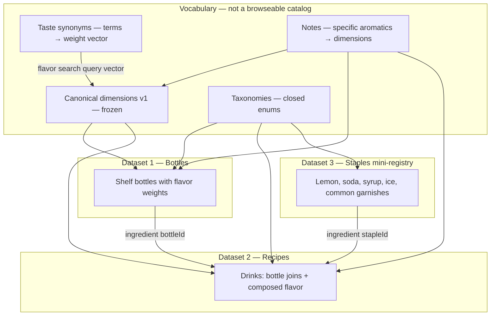

# Dataset design: classified catalogs for two-modal discovery

**Status:** Proposed (design only — no scoring pipeline, no search UI)  
**Serves:** [prds/PRODUCT-BRIEF-two-modal-discovery.md](../prds/PRODUCT-BRIEF-two-modal-discovery.md)  
**Replaces (data):** unweighted `liquors[].tags` plus the two-hop `tasteTags` → `tasteFamilyToLiquorTags` map in `taste-vocabulary.ts`. Those cannot score drinks, cannot inherit flavor, and drift as soon as a bottle tag is not in the map.

This document is the **data contract**. It is written so that, once a tiny seed is populated, search can be: **user picks bottle / drink / flavor**, then **fuzzy match** on names or on a query vector. Regex intent classification and a scoring pipeline come *after* this contract is stable. They are not designed here beyond the interfaces the data must support.

---

## 1. Goal

Enable **semantic-ish discovery without an LLM** by making every searchable thing a **classified record in one shared flavor space**.

| User selects | Query is | Match against |
|--------------|----------|----------------|
| Bottle | Fuzzy name / alias / type label | Bottle records |
| Drink | Fuzzy name / alias / family label | Recipe records |
| Flavor | Synonym mapper → **canonical weight vector** | Bottle `flavor` and recipe `flavor.composed` |

Unlock (“given this bottle, which next bottle completes the most drinks”) is **not** flavor search. It only needs **stable bottle IDs** on recipes and a flag for what counts as a shelf bottle. The same records serve both jobs.

---

## 2. Design principles

1. **One vector space.** Bottles, drinks, and taste queries are all sparse maps of the same frozen dimension ids → weights in `(0, 1]`. Scoring later is arithmetic on those maps. No embeddings, no model.

2. **Classify, don’t tag-soup.** Closed taxonomies for kind, family, method, role, staple vs shelf. Open *notes* (juniper, orange peel) are allowed only because they **also** map into the frozen dimensions. A note is never a rogue scoring axis.

3. **IDs are forever.** Kebab-case slugs. Never reuse. Rename via `names[]` aliases, not by changing `id`.

4. **Synonyms emit weights, not tags.** “Zesty” does not become the string `"zesty"` on a bottle. It becomes `{ citrus: 0.85, bright: 0.65 }` in the same space the catalogs already use.

5. **Extensibility is additive.** New bottles, recipes, synonyms, and notes are cheap. New **canonical dimensions** are rare and versioned. Never remove or rename a dimension; deprecate and stop writing it.

6. **Do not persist derived flavor.** On a drink, `inherited` and `composed` are **derived state**. Catalog source of truth is ingredients (plus staple/bottle profiles) and `flavor.authored`. Unlock ignores flavor. The UI can still show “from the bottles” vs “from how it’s made” by computing those views.

7. **Referential integrity is the product.** A recipe may only cite bottle/staple IDs that exist. Flavor keys may only be canonical dimension ids. Invalid data is a catalog bug, not a ranking quirk.

8. **Search fields are explicit.** Every entity has `names[]` (display name first). v1 fuzzy match uses those names (and classified labels). `description` and `instructions` stay on the record as first-class text for a later search or scoring tier if we want one.

---

## 3. Layers (what the “2–3 datasets” actually are)



| Layer | Browseable? | Why it exists |
|-------|-------------|---------------|
| Canonical dimensions | No | The scoring axes. Small and frozen. |
| Taste synonyms | No | Many user words → one query vector. |
| Notes | No (display only) | “Juniper” without exploding the vector space. |
| Taxonomies | No | Classification: kind, family, method, role. |
| **Bottles** | Yes | Dataset 1. Buy / own / start-from. |
| **Recipes** | Yes | Dataset 2. Make / start-from. |
| **Staples** | No in MVP | Tiny third registry so recipes are complete and unlock does not treat lemon as a SKU. |

Staples are the “maybe third dataset.” They are **classified IDs**, not a shopping catalog. `countsForUnlock: false`.

Current `Garnish` type in code collapses into staple rows plus a `garnish` object on the recipe (method + staple/note). Not a fourth catalog.

---

## 4. Canonical flavor dimensions (v1, frozen)

Weights are **intensities**, not a probability simplex. A Campari can be high `bitter` *and* high `citrus`. Omit zeros. Do not store `0`.

**v1 dimension ids** (do not add without bumping `flavorSpace: "v1"` → `"v2"`):

| id | Class | What it means on a bottle or a finished drink |
|----|-------|-----------------------------------------------|
| `sweet` | balance | Sugared, dessert, liqueur sweetness |
| `sour` | balance | Acid / tart (usually drink-level; bottles rarely carry this) |
| `bitter` | balance | Quinine, gentian, amaro, pith |
| `dry` | balance | Bone-dry, not-sweet impression (not merely “low sweet”) |
| `salty` | balance | Saline, briny, olive |
| `citrus` | aromatic | Lemon, lime, orange, grapefruit character |
| `herbal` | aromatic | Botanical, green, pine, amaro herbs |
| `floral` | aromatic | Elderflower, rose, perfume |
| `fruity` | aromatic | Stone fruit, berry, tropical (not citrus) |
| `spicy` | aromatic | Pepper, baking spice, chile heat-as-spice |
| `smoky` | aromatic | Peat, char, smoke |
| `earthy` | aromatic | Soil, vegetal, gentian root, agave earth |
| `nutty` | aromatic | Almond, hazelnut, orgeat |
| `oak` | aromatic | Barrel, vanilla-oak, oxidative wood |
| `bright` | impression | High-tone, lively, zing — how drinkers talk |
| `rich` | impression | Body, depth, dessert weight |
| `hot` | impression | Alcohol heat |
| `creamy` | texture | Dairy, foam, silky body |

**Deliberately not dimensions:** `complex`, `smooth`, `warm`, `chocolate`, `coffee`, `vanilla`, `anise`, `mint`, `juniper`, `orange`. Those are **notes or synonyms** that *project into* this space. Keeping them out of the axes is what makes the space extensible: you can add a hundred notes without a migration.

**Rules:**

- Every `flavor` map key ∈ this table.
- Weight ∈ `(0, 1]`, typically authored in tenths (`0.3`, `0.6`, `0.9`).
- A record SHOULD have 3–8 non-zero dimensions. More is usually noise.
- Bottles SHOULD NOT carry `sour` unless the liquid is actually acidic (verjus, citrus liqueur). Sours live on drinks via authored/staple contribution.

---

## 5. Taste synonym mapper

This is the non-LLM “semantic” layer. It is **data**, not code.

A synonym maps **one or more search terms** to a **canonical weight vector** (and optional notes). Flavor-mode search: normalize token(s) → lookup → query vector → later score against catalogs.

```json
{
  "id": "syn-zesty",
  "terms": ["zesty", "zest", "zippy"],
  "profile": { "citrus": 0.85, "bright": 0.65 },
  "noteIds": ["note-citrus"]
}
```

| Field | Rule |
|-------|------|
| `id` | Stable. `syn-{slug}` |
| `terms` | Lowercase, unique **across the whole synonym file**. Longest-term wins on overlap (`star anise` before `anise`). |
| `profile` | Non-empty. Keys ⊆ v1 dimensions. This **is** the query vector for those terms. |
| `noteIds` | Optional. For display and future note-boost; not required for v1 scoring. |

**Coverage types** (all are synonym rows; the `kind` field is classification, not a different matcher):

| `kind` | Examples | Maps to |
|--------|----------|---------|
| `dimension` | bitter, sweet, dry, smoky | That dimension at `1.0` (plus tiny neighbors if useful) |
| `impression` | bright, rich, “not sweet” | Dimension vector (negation is a later intent concern; for now a row `terms: ["not sweet", "dry"]` can point at `dry`) |
| `note` | juniper, orange, peat, cocoa | Projection into dimensions |
| `slang` | “boozy”, “refreshing”, “dessert-y” | Impression vector |

**Not in this file:** bottle type words (`gin`, `amaro`) and drink names (`negroni`). Those live on entity `names[]`. If search setting is **flavor**, type words do not match through this table. If setting is **bottle**, they fuzzy-match bottle names/kinds. That is how we skip intent classification for now.

**Multi-word flavor queries** (later, still no LLM): split on `and`/commas, map each token, **max** (or sum-and-clamp) the vectors. Design now so each synonym is one vector; combining vectors is a scoring-pipeline rule, not a schema change.

**Extending:** add a row. Never change an existing `profile` without treating it as a data version bump — rankings will move.

---

## 6. Notes (specific aromatics)

Notes are a classified list so bottles can say “juniper” without making `juniper` a 19th dimension.

```json
{
  "id": "note-juniper",
  "label": "Juniper",
  "profile": { "herbal": 0.7, "bright": 0.2, "dry": 0.2 }
}
```

Bottles and drinks may list `noteIds[]`. Flavor search on “juniper” hits the synonym → same space. Optionally a later scorer can add a small bonus when `noteIds` overlap. v1 can ignore that bonus and still work.

Adding notes is the **normal** way to grow vocabulary. Adding dimensions is the exceptional way.

---

## 7. Taxonomies (closed classification)

Stored as id lists. Records may only use ids from these lists. Growing a taxonomy = append an id (additive). Removing an id = migration.

### Bottle

| Taxonomy | v1 ids |
|----------|--------|
| `bottleKind` | `spirit`, `whiskey`, `amaro`, `liqueur`, `vermouth`, `bitters`, `fortified-wine`, `other` |
| `spiritFamily` | `gin`, `vodka`, `rum`, `agave`, `brandy`, `whiskey-bourbon`, `whiskey-rye`, `whiskey-scotch`, `whiskey-irish`, `whiskey-other`, `amaro`, `vermouth`, `liqueur-orange`, `liqueur-herbal`, `liqueur-other`, `bitters-aromatic`, `bitters-citrus`, `other` |
| `typicalRole` | `base`, `modifier`, `bitter`, `accent`, `lengthener` |

`bottleKind` replaces today’s `LiqourType` (which stuffed gin and vermouth into `SPIRIT`). Classification is two-level: kind + family.

### Recipe

| Taxonomy | v1 ids |
|----------|--------|
| `drinkFamily` | `sour`, `highball`, `spritz`, `old-fashioned`, `martini-manhattan`, `negroni-family`, `fizz`, `cobbler`, `tiki`, `other` |
| `method` | `stir`, `shake`, `build`, `blend`, `swizzle`, `throw` |
| `glass` | `coupe`, `rocks`, `highball`, `nick-and-nora`, `flute`, `other` |
| `ingredientRole` | `base`, `modifier`, `bitter`, `accent`, `rinse`, `lengthener`, `sweetener`, `citrus`, `garnish` |

### Staple

| Taxonomy | v1 ids (seed; append freely) |
|----------|--------|
| `stapleId` | `staple-lemon-juice`, `staple-lime-juice`, `staple-simple-syrup`, `staple-soda`, `staple-egg-white`, `staple-ice`, `staple-orange-peel`, `staple-orange-slice`, `staple-lemon-peel` |
| `stapleKind` | `citrus-juice`, `syrup`, `sparkling`, `dairy-egg`, `ice`, `garnish` |

A staple that is actually scarce on the shelf (orgeat, Falernum, orange bitters) is **not** a staple — it is a bottle.

---

## 8. Dataset 1 — Bottle record

```json
{
  "id": "bottle-campari",
  "schemaVersion": 1,
  "flavorSpace": "v1",
  "names": ["Campari", "campari"],
  "brand": "Campari",
  "description": "Iconic Italian bitter aperitivo: orange, rhubarb, and gentian; the red backbone of a Negroni.",
  "kind": "amaro",
  "spiritFamily": "amaro",
  "typicalRole": "bitter",
  "flavor": {
    "bitter": 0.9,
    "citrus": 0.6,
    "herbal": 0.5,
    "sweet": 0.4,
    "bright": 0.5
  },
  "noteIds": ["note-orange", "note-rhubarb", "note-gentian"],
  "countsForUnlock": true
}
```

| Field | Required | Notes |
|-------|----------|--------|
| `id` | yes | `bottle-{slug}` |
| `names` | yes | Index 0 is display name. Further entries are aliases for fuzzy match (case-insensitive). |
| `description` | yes | Short summary or context. Authored free text (not a taxonomy id). |
| `brand` | no | Omit on generics (`London dry gin`). |
| `kind`, `spiritFamily`, `typicalRole` | yes | Taxonomy ids. |
| `flavor` | yes | Sparse v1 weights. The bottle’s scoring vector. Liquid in the bottle, not in a drink. |
| `noteIds` | no | Must exist in the notes file. |
| `countsForUnlock` | yes | Always `true` for Dataset 1. Present so bottles and staples share a mental model. |

**Generic vs branded:** v1 uses **generic-or-iconic** rows (`bottle-gin-london-dry`, `bottle-campari`). Recipes point at those ids. Branded SKUs can be added later as extra bottles with `equivalentId` (out of scope now; field not in v1 schema so we don’t pretend substitutions work).

---

## 9. Dataset 2 — Recipe record

```json
{
  "id": "drink-negroni",
  "schemaVersion": 1,
  "flavorSpace": "v1",
  "names": ["Negroni", "negroni"],
  "description": "Equal parts gin, Campari, and sweet vermouth; stirred, bitter, and orange-bright.",
  "drinkFamily": "negroni-family",
  "method": "stir",
  "glass": "rocks",
  "ingredients": [
    {
      "componentKind": "bottle",
      "componentId": "bottle-gin-london-dry",
      "role": "base",
      "amountMl": 30
    },
    {
      "componentKind": "bottle",
      "componentId": "bottle-campari",
      "role": "bitter",
      "amountMl": 30
    },
    {
      "componentKind": "bottle",
      "componentId": "bottle-vermouth-sweet",
      "role": "modifier",
      "amountMl": 30
    }
  ],
  "garnish": {
    "stapleId": "staple-orange-peel",
    "method": "express"
  },
  "instructions": "Stir gin, Campari, and sweet vermouth with ice until well chilled. Strain into a rocks glass over ice. Express an orange peel over the drink and drop it in.",
  "flavor": {
    "authored": { "bright": 0.15, "citrus": 0.15 },
    "composeRule": "v1"
  }
}
```

`inherited` and `composed` are **not catalog fields**. They are computed views (see §10).

| Field | Required | Notes |
|-------|----------|--------|
| `ingredients` | yes | At least one `componentKind: "bottle"`. Staples allowed. |
| `componentId` | yes | Must exist in bottles or staples. |
| `role` | yes | Drives inheritance weights (below). |
| `amountMl` | yes | Canonical unit for mix math. Dashes ≈ `1` ml. |
| `garnish` | no | Classified; contributes to **authored** flavor, not unlock. |
| `description` | yes | Short summary or context. Authored free text. Distinct from `instructions` (how to make it). |
| `instructions` | yes | Free-text how-to for the drink. Authored. |
| `flavor.authored` | yes | Prep / mixology / garnish. The only drink-level flavor persisted. Empty `{}` only if truly nothing beyond the bottles (rare). |
| `flavor.composeRule` | yes | Which derivation function to use (`"v1"`). Not itself a flavor map. |

**Unlock set** for a drink = distinct `componentId` where `componentKind === "bottle"` AND that bottle has `countsForUnlock: true`. Staples and garnishes are ignored.

---

## 10. Flavor composition contract (v1) — derived vs authored

| Piece | Kind | Source of truth? | Persist in catalog JSON? |
|-------|------|------------------|--------------------------|
| Bottle `flavor` | Authored | Yes (the liquid) | Yes |
| Staple `flavor` | Authored | Yes (small, optional) | Yes |
| Recipe ingredients, roles, ml, garnish, `description`, `instructions` | Authored | Yes | Yes |
| Bottle `description` | Authored | Yes | Yes |
| Recipe `flavor.authored` | Authored | Yes (prep / mixology / garnish deltas) | Yes |
| Recipe `flavor.inherited` | **Derived** | No — `f(ingredients, bottle/staple profiles, composeRule)` | **No** |
| Recipe `flavor.composed` | **Derived** | No — `clamp(inherited + authored)` | **No** |

**Why inherited is derived:** it is a pure function of other records. Storing it duplicates bottle data onto every drink. When Campari’s `bitter` weight changes, every Negroni-family drink would otherwise be stale. The same bug class as caching a total next to line items.

**What may be materialized:** an *index* or in-memory view at load time (`inherited`, `composed`) for search speed and UI (“from the bottles”). That is a cache, not catalog data. If the cache disagrees with a recompute, the cache is wrong. Do not hand-edit `composed` to “taste right”; change `authored` or the bottle profiles instead.

**Validity:** a drink is valid if ingredients resolve, `authored` keys ⊆ v1 dimensions, and `composeRule` is known. There is no ε-check against stored inherited/composed, because those maps are not stored.

### 10.1 Role weights (inheritance)

Contribution of a component:

`contrib = amountMl × roleFactor × (countsForUnlock ? 1 : stapleFactor)`

| `ingredientRole` | `roleFactor` |
|------------------|--------------|
| `base` | 1.0 |
| `modifier` | 0.85 |
| `bitter` | 0.9 |
| `sweetener` | 0.7 |
| `citrus` | 0.8 |
| `lengthener` | 0.2 |
| `accent` | 0.25 |
| `rinse` | 0.1 |
| `garnish` | 0 (garnish is authored, not inherited) |

Staples that carry flavor (lemon juice, simple syrup, soda) use the same table (`citrus`, `sweetener`, `lengthener`) with their own small `flavor` map on the staple row. Ice: no flavor.

**Inherited dimension d** = Σ (component.flavor[d] × contrib) / Σ contrib, then round to 2 decimals, drop zeros.

Cameos cannot dominate: a 1 ml rinse vs 90 ml of bases is naturally small. Bitters as a **defining** bottle (Campari at 30 ml, role `bitter`) are not cameos.

### 10.2 Authored (prep / mixology / garnish)

Hand-written vector. Guidance, not code:

| Source | Typical authored bump |
|--------|------------------------|
| Stirred, spirit-forward | slight `rich` / `hot`; little `sour` |
| Shaken with citrus | `sour`, `bright`, `citrus`; less `hot`/`rich` than the bottles neat |
| Built long with soda | `bright`, `dry`; lower `rich`/`hot` |
| Orange peel expressed | `bright`, `citrus` |
| Egg white | `creamy`; slight mute of `hot` |

Authored values are **deltas in the same 0–1 space**, kept small (about `0.1–0.25`) so they adjust rather than replace the bottles.

### 10.3 Composed

For each dimension d:

`composed[d] = clamp01( inherited[d] + authored[d] )`

Omit zeros. `clamp01` = min(1, max(0, x)). Round to 2 decimals after clamp.

Bottles never inherit. A rye bottle does not become `sour` because it appears in a whiskey sour.

---

## 11. Staple record (mini Dataset 3)

```json
{
  "id": "staple-soda",
  "schemaVersion": 1,
  "flavorSpace": "v1",
  "names": ["soda water", "club soda", "seltzer"],
  "stapleKind": "sparkling",
  "countsForUnlock": false,
  "flavor": { "bright": 0.2, "dry": 0.2 }
}
```

Assumed on hand. Recipes may cite them. Unlock ignores them.

---

## 12. Integrity rules (catalog is wrong if any fail)

1. All ids unique within their file; no cross-file id collisions (`bottle-` / `drink-` / `staple-` / `note-` / `syn-` prefixes).
2. `flavor` / `profile` keys ⊆ v1 dimensions; values in `(0, 1]`.
3. Taxonomy fields ∈ taxonomy files.
4. `noteIds` ⊆ notes file.
5. Recipe `componentId` exists; `componentKind` matches the file it lives in.
6. Every recipe has ≥ 1 unlock bottle.
7. Every synonym `terms[]` entry is unique globally; `profile` non-empty.
8. `names[0]` is the display name; all `names` unique within that entity type after casefold.
9. Bottle and recipe `description`, and recipe `instructions`, are non-empty strings. `description` is a short summary/context; `instructions` is the how-to.
10. Recipe `flavor` persists only `authored` + `composeRule`. No `inherited` or `composed` keys in catalog JSON.
11. `schemaVersion` and `flavorSpace` present on bottles, recipes, staples.
12. `composeRule` is a known id (`v1`). Derived views must be produced only by that rule.

These rules are the definition of **classified and rock-solid**. A later validator should implement them as tests, not as comments.

---

## 13. Extensibility (how we grow without breaking scoring)

| Change | How | Breaks old scores? |
|--------|-----|--------------------|
| Add bottle / drink / staple | Append record | No |
| Add synonym terms | Append or add `terms` | Only if you edit existing `profile` |
| Add note | Append note + optional synonym | No |
| Add taxonomy id | Append to taxonomy file | No |
| Split generic gin into SKUs | New bottles; recipes keep generic id until a substitution field exists | No |
| Add canonical dimension | `flavorSpace: "v2"`; migrate all profiles | Yes — explicit version |
| Rename dimension | Forbidden. New id + migrate + deprecate old | Yes |
| Change composeRule | `"v2"` on new recipes; don’t silently rewrite v1 | Yes for drinks |

**Do not** put scoring coefficients (role factors, ε, clamp) in each record except `composeRule`. Coefficients live in one rule document (this file, §10). Records stay data.

---

## 14. What this enables next (not in this phase)

Once seed records exist:

1. **Search settings + fuzzy names** — bottle/drink mode over `names[]` (and kind/family labels). No intent parser.
2. **Flavor mode** — tokenize query, synonym lookup, query vector, rank `bottle.flavor` and `drink.flavor.composed` with one similarity function (dot product or cosine on the union of keys). Deterministic.
3. **Unlock** — set cover of size 1: seed bottle id → other bottle ids by count of newly complete drinks.
4. **Regex intent (optional later)** — classify free text into the same three modes. The datasets do not depend on it. Skip until fuzzy+settings are boringly correct.
5. **Possible vs likely** — possible = membership (ingredient join, or flavor above a low floor). Likely = rank by similarity. Thresholds are scoring, not schema.
6. **Later text tier (optional)** — `description` / `instructions` can be layered in as another score signal (e.g. local embeddings over a vector store, no LLM required). That does not change the catalog schema; v1 simply does not use that tier yet.

The data does **not** need embeddings, LangChain, or chat memory to do any of this.

---

## 15. File layout (when we populate)

Proposed, not wired into the app yet:

```
data/
  meta.json                 # schemaVersion, flavorSpace: "v1"
  taxonomies.json           # all closed enums
  flavor-dimensions.json    # the 18 ids + labels + class
  notes.json
  taste-synonyms.json
  staples.json
  bottles.json
  recipes.json
```

Keep this **out of** `recipe-book.ts`. That file is the legacy tag soup. New catalogs should be data the app loads, so authors can extend without touching scoring code.

---

## 16. Seed records (normative examples)

Minimum set that proves **joins, inheritance, authored garnish, staples, unlock, and flavor search**. Three bottles + two drinks + a handful of synonyms — not a full catalog.

### 16.1 Notes (subset)

| id | label | profile |
|----|-------|---------|
| `note-juniper` | Juniper | herbal 0.7, dry 0.2, bright 0.2 |
| `note-orange` | Orange | citrus 0.8, bright 0.3, fruity 0.2 |
| `note-rhubarb` | Rhubarb | bitter 0.3, earthy 0.3, fruity 0.2 |
| `note-gentian` | Gentian | bitter 0.6, earthy 0.4 |
| `note-vanilla` | Vanilla | sweet 0.4, oak 0.3, rich 0.2 |
| `note-baking-spice` | Baking spice | spicy 0.6, sweet 0.2, oak 0.2 |

### 16.2 Bottles (3)

**`bottle-gin-london-dry`** — generic London dry gin  

- kind `spirit`, family `gin`, role `base`  
- flavor: `herbal` 0.7, `dry` 0.7, `citrus` 0.35, `bright` 0.45, `hot` 0.4  
- notes: juniper  

**`bottle-campari`** — Campari  

- kind `amaro`, family `amaro`, role `bitter`  
- flavor: `bitter` 0.9, `citrus` 0.6, `herbal` 0.5, `sweet` 0.4, `bright` 0.5  
- notes: orange, rhubarb, gentian  

**`bottle-vermouth-sweet`** — sweet vermouth  

- kind `vermouth`, family `vermouth`, role `modifier`  
- flavor: `sweet` 0.7, `herbal` 0.55, `rich` 0.5, `oak` 0.35, `spicy` 0.3, `bitter` 0.25  
- notes: vanilla, baking-spice  

### 16.3 Staples used

**`staple-soda`** — flavor `bright` 0.2, `dry` 0.2; unlock false  
**`staple-orange-peel`** — garnish; no inheritance flavor  
**`staple-orange-slice`** — garnish; no inheritance flavor  

### 16.4 Drinks (2)

Equal-parts stirred Negroni vs built Americano (same two modifiers, soda instead of gin). This is the unlock proof: **from Campari alone, sweet vermouth completes the Americano; gin completes nothing until vermouth is also present.**

**`drink-negroni`** — stir, rocks, orange peel expressed  

Instructions: free text, e.g. stir with ice, strain over ice, express orange peel.

Ingredients: gin 30 ml `base`, Campari 30 ml `bitter`, sweet vermouth 30 ml `modifier`.

Inherited (v1 mix, rounded): gin contrib 30, Campari 27, vermouth 25.5; total 82.5  

| dim | inherited |
|-----|-----------|
| herbal | 0.59 |
| bitter | 0.40 |
| citrus | 0.32 |
| sweet | 0.36 |
| dry | 0.25 |
| bright | 0.33 |
| hot | 0.15 |
| rich | 0.15 |
| oak | 0.11 |
| spicy | 0.09 |

Authored (stir + orange oil): `bright` 0.15, `citrus` 0.15  

Composed: inherited + authored, clamp (notably `bright` 0.48, `citrus` 0.47; others unchanged).

**`drink-americano`** — build, highball, orange slice  

Ingredients: Campari 30 ml `bitter`, sweet vermouth 30 ml `modifier`, soda 90 ml `lengthener`.

Soda contrib = 90 × 0.2 = 18; Campari 27; vermouth 25.5; total 70.5. Lengthening dilutes bottle intensity; authored adds `bright`/`dry` from the highball.

Authored: `bright` 0.2, `dry` 0.15  

(Exact inherited/composed numbers for the Americano are filled when seed JSON is generated by the same formula — do not hand-round a second way.)

### 16.5 Synonyms (enough to prove flavor mode)

| terms | profile |
|-------|---------|
| bitter, bitterness | bitter 1.0 |
| sweet, sugary | sweet 1.0 |
| dry, brut | dry 1.0 |
| bright, lively | bright 1.0 |
| herbal, botanical, juniper | herbal 0.85, dry 0.25 |
| citrus, orange, zesty, zippy | citrus 0.85, bright 0.5 |
| rich, boozy | rich 0.7, hot 0.3 |

Flavor query **“bitter”** → `{ bitter: 1 }` → Campari and Negroni rank above London dry gin.  
Flavor query **“zesty”** → `{ citrus: 0.85, bright: 0.5 }` → Campari and Negroni (composed citrus/bright) outrank sweet vermouth.  
Bottle query **“campari”** → fuzzy `names[]`, no synonym table.  
Drink query **“negroni”** → fuzzy `names[]`.

---

## 17. Explicit non-goals for this design phase

- Scoring function details beyond “same vector space + later similarity.”
- Regex / intent classification.
- Populating the full ~50 bottle list or a real recipe book.
- Migrating `recipe-book.ts` / chat code.
- Substitutions, brands, prices, user cabinet persistence.
- LLM or embedding fields on records.

---

## 18. Proposed next steps (after this design is accepted)

1. Accept or amend v1 dimensions, taxonomies, and composeRule.  
2. Land `data/*.json` with this seed (3 bottles, 2 drinks, staples, notes, synonyms) and a **validator test** for §12 + §10 ε check.  
3. Fuzzy match by search setting (bottle / drink / flavor).  
4. Scoring pipeline on `flavor` / `composed`.  
5. Unlock from a seed bottle.  
6. Only then: regex intent, if free text is still wanted.

---

## 19. Open questions (data-specific)

1. **Generic gin vs Beefeater.** Is one generic `bottle-gin-london-dry` enough until SKUs exist, or do recipes need brand ids on day one?
2. **Dashes to ml.** Is 1 ml per dash acceptable, or do bitters need `amountDash` plus a conversion constant?
3. **Synonym uniqueness vs phrases.** Longest-match on `terms` — do we also allow a term to appear in two rows with different profiles? (Recommend: no.)
4. **Negation.** Is “not sweet” a synonym row pointing at `dry`, or reserved for a later intent layer? Recommend: a single explicit synonym for v1, no general negation parser yet.
5. **`dry` vs inverse of `sweet`.** Keep both as independent dimensions (recommended), or derive `dry` and forbid co-occurrence above a threshold?
6. **Staple flavor on soda/juice.** Do we inherit staple flavor at all, or keep all non-bottle taste in `authored` so Dataset 3 stays IDs-only? Current design inherits staple flavor with low `roleFactor` so Americano dilution is mechanical.
7. **Stored vs computed inherited.** **Resolved:** `inherited` and `composed` are derived. Catalog stores `authored` + `composeRule` only. Materialize views at load/index time if needed; never as source of truth.
8. **Editorial override of composed.** Out of scope. If a drink “doesn’t taste like the formula,” fix `authored` or bottle weights — do not snapshot a hand-tuned `composed`.
9. **Dimension count.** 18 may still be wide for a tiny seed. If we cut, `salty`, `floral`, `nutty`, `smoky` are the first to fold into notes-only until the catalog needs them — but folding later is a v2. Prefer keeping the frozen set even if seed bottles don’t use every axis.
10. **Drink family granularity.** `negroni-family` vs folding Negroni into `martini-manhattan` (both stirred, equal parts-ish). Affects browse, not scoring.

---

## Related documents

- [prds/PRODUCT-BRIEF-two-modal-discovery.md](../prds/PRODUCT-BRIEF-two-modal-discovery.md) — product; this file answers its data open questions with proposed defaults.
- [PRODUCT.md](../PRODUCT.md) — chosen direction A.
- [src/app/core-services/SCORING.md](../src/app/core-services/SCORING.md) — **legacy** tag scoring; do not extend it. Replace after catalogs exist.
