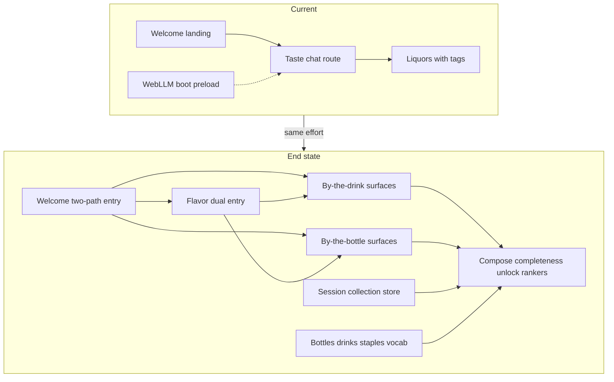
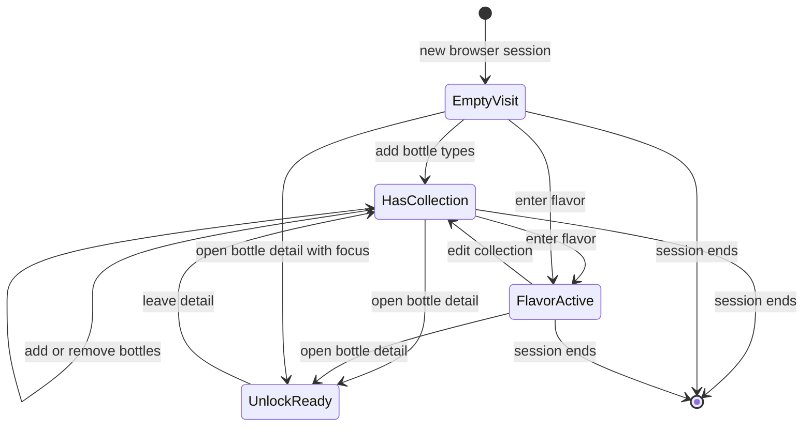
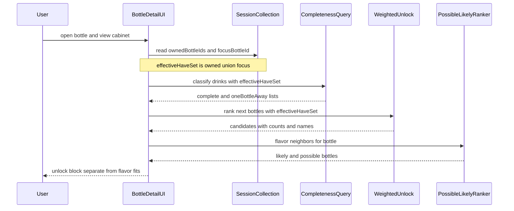
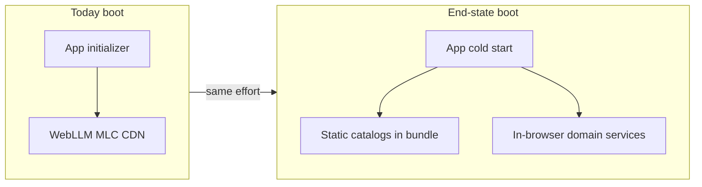

# Architecture overview: Two-modal discovery

End state after this feature lands: a client-only Angular SPA whose primary path is **drink/bottle discovery** over static classified catalogs, session collection state, and deterministic domain services. Taste chat and WebLLM boot preload are gone from the product path.

**Overview version:** 2 (successor of v1; remediates Ponytail pre-build)

## Current-to-end delta

| Area | Today | End state |
|------|-------|-----------|
| Entry | Welcome → taste chat (`?q=`) | Welcome → by drink / by bottle / flavor dual entry |
| Catalogs | ~51 liquors with unweighted tags; empty `recipeBook` | Migrated weighted type-level bottles; ~20 drinks with joins; staples registry; shared vocabulary |
| Intelligence | Tag-family liquor ranking + optional WebLLM narration | Compose, completeness (owned ∪ focus on detail), possible/likely, weighted unlock without classic-ness (LLM-free) |
| Cabinet | None | Session-scoped bottle collection from weighted catalog only |
| Chrome | “Taste chat” nav | Two-path cabinet copy only |
| Boot | WebLLM CDN preload on app init | Cold start with static catalogs only |

### Current-to-end discovery context

Cross-system boundary change: chat path retires; catalogs, collection, and unlock become first-class.

Diagram validation: manual Mermaid syntax review (flowchart); no repository validator.

## Object models

### Bottle (type-level)

| Field | Notes |
|-------|-------|
| id | Stable type slug (e.g. dry vermouth); migrated from legacy liquor ids where applicable |
| names | Display name first, then aliases |
| description | Authored short context |
| kind / spiritFamily / typicalRole | Closed taxonomies |
| flavor | Sparse map dimension → weight in (0, 1] |
| countsForUnlock | true for shelf bottles |

Invariant: unlock, recipe joins, and collection ownership use the same type ids. Every collectable id is a weighted catalog record — no tag-soup dual model. Picker universe may include all migrated legacy liquors; unlock credibility remains on ~20 authored drinks.

### Drink (recipe)

| Field | Notes |
|-------|-------|
| id | Stable drink slug |
| names, description, instructions | Authored text |
| ingredients | Rows: bottle or staple id, role, amount |
| garnish | Optional classified finishing |
| flavor.authored | Prep/mixology/garnish deltas |
| flavor.composeRule | Known rule id (proposed `v1`) |

Invariant: `inherited` and `composed` are derived views only. ≥1 unlock bottle per drink. Cameo shelf bottles count as required. No classic-ness field for MVP (`DEC-unlock-classic-deferred`).

### Staple (Dataset 3)

| Field | Notes |
|-------|-------|
| id | Stable staple slug |
| names, stapleKind | Identity |
| flavor | Optional small profile |
| countsForUnlock | always false |

Invariant: completeness treats staples as available; unlock never recommends them.

### Flavor vocabulary

| Piece | Role |
|-------|------|
| Canonical dimensions | Frozen scoring axes (`flavorSpace`) |
| Synonyms | Terms → weight vector |
| Notes | Optional aromatic projections |

Invariant: no rogue tag axes in new ranking.

### Session collection

| Field | Notes |
|-------|-------|
| ownedBottleIds | Set of bottle type ids for this visit (catalog-only) |
| focusBottleId | Optional seed/focus; on bottle detail included in effective have-set |
| flavorTerms / flavorVector | Active flavor entry |

Invariant: session-scoped only; not a catalog; cleared across visits. Effective have-set for completeness and unlock on bottle detail = `ownedBottleIds ∪ {focusBottleId}`.

## Contracts

### Catalog integrity

- **Owner:** backend (in-browser)
- **Inputs:** catalog bundle
- **Outputs:** pass or concrete violations
- **Errors:** missing component ids, illegal flavor keys, drinks with zero unlock bottles, collection-eligible ids missing from weighted bottles

### Drink flavor composition

- **Owner:** backend
- **Inputs:** drink + resolved bottle/staple profiles
- **Outputs:** `inherited`, `composed`
- **Errors:** unknown compose rule
- **UI:** composed by default; split on demand

### Drink completeness

- **Owner:** backend
- **Inputs:** effective have-set + drink (on bottle detail: owned ∪ focus)
- **Outputs:** complete | oneBottleAway | incomplete + missing bottle ids
- **Errors:** none expected if integrity holds; staples never listed as missing buys
- **Shared set:** same effective have-set as weighted unlock on bottle detail

### Weighted unlock

- **Owner:** backend
- **Inputs:** effective have-set (owned ∪ focus on bottle detail), optional user flavor vector, drink catalog
- **Outputs:** ranked next bottles with newly completable count, weighted score (count + seed-as-lead + flavor; classic-ness omitted), drink names
- **Errors / empty:** empty list when nothing improves coverage; never prefer zero-unlock when better exist; never invent classic scores
- **Separation:** taste neighbors are a separate labeled list

### Possible and likely ranking

- **Owner:** backend
- **Inputs:** bottle id or flavor query vector
- **Outputs:** possible/likely drinks and bottles with data-grounded reasons
- **Errors / empty:** explicit empty; never invent entities

### Session collection / navigation

- **Owner:** frontend
- **Inputs:** user toggles and mode navigation
- **Outputs:** durable-for-visit have-set consumed by completeness and unlock
- **Errors:** reject unknown bottle ids (non-catalog)

### Static catalog assets

- **Owner:** infrastructure
- **Inputs:** versioned files in repo (migrated bottles + drinks + staples + vocab)
- **Outputs:** assets available to the SPA at runtime/build
- **Errors:** missing assets fail build or integrity tests

## Session collection lifecycle

Non-trivial UI/server-adjacent state: visit cabinet and flavor.

Diagram validation: manual Mermaid syntax review (stateDiagram-v2); no repository validator.

## Unlock and recommendation sequence

Multi-step domain interaction on bottle detail. Completeness and unlock share `owned ∪ {focus}`.

Diagram validation: manual Mermaid syntax review (sequenceDiagram); no repository validator.

## Boot runtime delta

Material infrastructure change: remove WebLLM CDN preload from cold start. Hosted target remains unknown and is not the deployment story — no decorative unknown-host hop.

Diagram validation: manual Mermaid syntax review (flowchart); no repository validator. Local `ng serve` / `ng build` → static `dist` + catalogs remains unchanged prose topology; hosted platform is a non-blocking unknown.

## Durable docs to update when implementing

- `ARCHITECTURE.md` — entities, demote chat, cabinet/unlock, staples, file index, WebLLM boot removal
- `PRODUCT.md` — landing handoff and elevator claims
- No ADR tree in repo; consequential compose/unlock defaults recorded as proposed decisions in the requirements artifact until human-nodded
