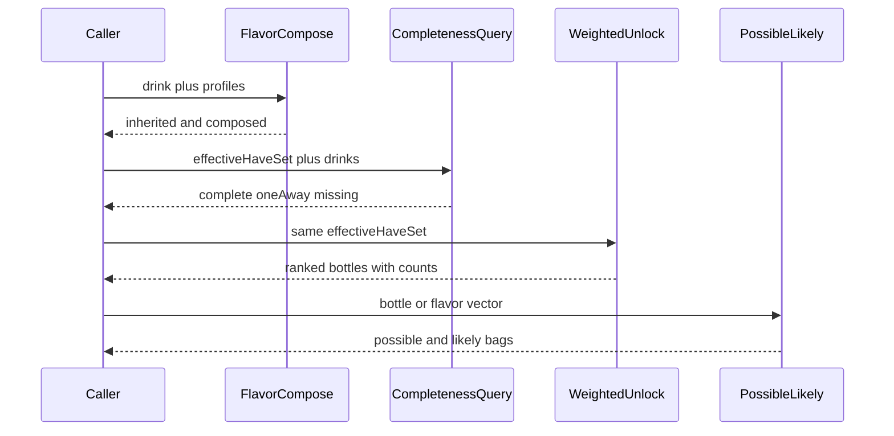

# Discovery ranking services

Slice of the end state: deterministic compose, completeness (`owned ∪ {focus}` on bottle detail), possible/likely bags, and weighted unlock without classic-ness — pure domain services over the catalog bundle.

Area: backend · Internal ID: `PR-two-modal-discovery-002`

## Overview facets

- [Drink flavor composition](../architecture-overview.md#drink-flavor-composition)
- [Drink completeness](../architecture-overview.md#drink-completeness)
- [Weighted unlock](../architecture-overview.md#weighted-unlock)
- [Possible and likely ranking](../architecture-overview.md#possible-and-likely-ranking)
- [Unlock and recommendation sequence](../architecture-overview.md#unlock-and-recommendation-sequence)

## Nominal flow

## Docs owned

`ARCHITECTURE.md` composition, completeness, unlock, and possible/likely scoring notes.
