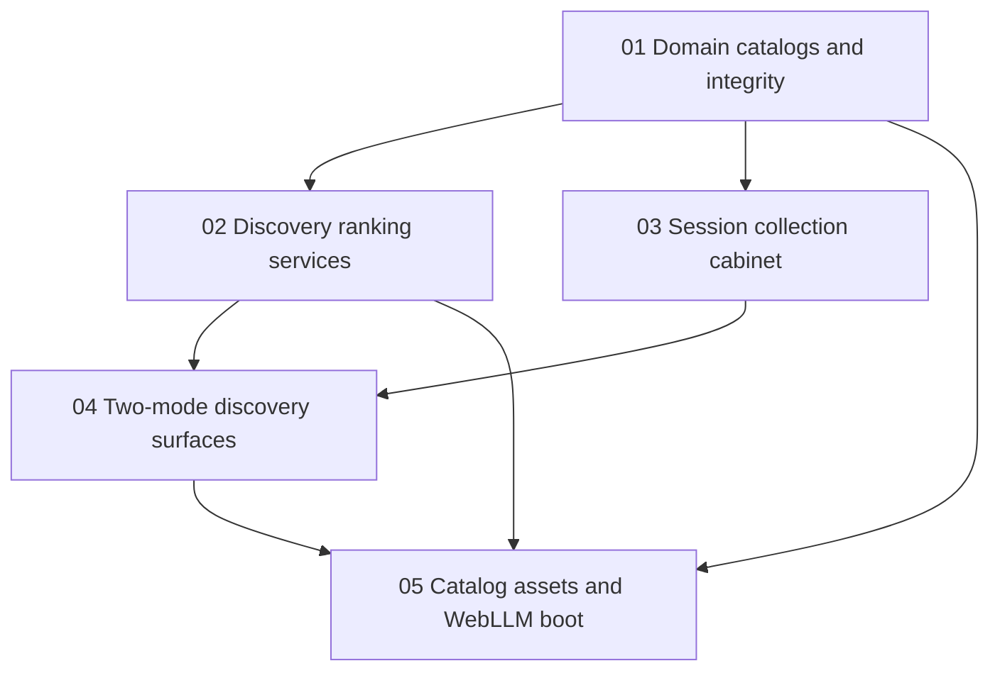

# Pull Request Sequence

Status: accepted
Approved-by: `HRV-approve-pr-sequence-001`

Feature: Two-modal discovery  
Sequence version: 1  
Requirements input: Two-modal discovery technical requirements (`REQ-two-modal-discovery-001`) version 2  
Approval: Approve two-modal discovery technical requirements (`HRV-approve-technical-requirements-001`)

## Ordering rationale

Backend lands first so catalog models and discovery contracts exist before UI consumers. Session collection can start once bottle catalog ids exist, in parallel with ranking services. Discovery surfaces wait for both ranking contracts and session collection. Infrastructure is last: no net-new hosted resource blocks development; static asset wiring and WebLLM boot removal follow application work. No frontend-leading / unimplemented-endpoint exception is used.

## Dependency graph

Diagram validation: manual Mermaid syntax review (flowchart); no repository validator.

## Sequence

| Order | PR note | Area | Depends on |
|-------|---------|------|------------|
| 1 | [Domain catalogs and integrity](./prs/01-backend-catalogs-and-integrity.md) | backend | — |
| 2 | [Discovery ranking services](./prs/02-backend-discovery-services.md) | backend | 01 |
| 3 | [Session collection cabinet](./prs/03-frontend-session-collection.md) | frontend | 01 |
| 4 | [Two-mode discovery surfaces](./prs/04-frontend-two-mode-discovery.md) | frontend | 02, 03 |
| 5 | [Catalog assets and WebLLM boot](./prs/05-infrastructure-catalog-assets-and-webllm.md) | infrastructure | 01, 02, 04 |

### Domain catalogs and integrity (`PR-two-modal-discovery-001`)

- Meaning: Migrate weighted catalogs, vocabulary, drinks, staples, and integrity validation.
- Area: backend
- Requirements: Type-level bottle catalog (`MODEL-bottle-catalog`); Drink catalog with joins (`MODEL-drink-catalog`); Non-bottle staples catalog (`MODEL-staples-catalog`); Shared flavor vocabulary (`MODEL-flavor-vocabulary`); Catalog integrity contract (`CONTRACT-catalog-integrity`)
- Depends on: none
- Contract produced/consumed: Produces catalog bundle types and integrity pass/fail; consumed later by ranking, UI, and static assets.
- Durable architecture docs/ADRs owned: `ARCHITECTURE.md` entity catalog sections (bottles with weights, recipes, staples registry, flavor vocabulary / `taste-vocabulary` replacement). No ADR tree.
- Architecture draft sources: `architecture/two-modal-discovery-backend.md`
- Worktree branch intent: `uf/two-modal-discovery/01-backend-catalogs-and-integrity` (not created by sequencer)
- Acceptance checks: Migrated weighted bottles load; ~20 drinks with joins; staples present; integrity suite fails closed on bad joins/keys; picker-eligible ids ⊆ bottle catalog.
- Packet: `.universal-flow/runs/20260817-1826-two-modal-discovery/pull-requests/01-backend-catalogs-and-integrity-packet.md`
- Published note: [01-backend-catalogs-and-integrity.md](./prs/01-backend-catalogs-and-integrity.md)

### Discovery ranking services (`PR-two-modal-discovery-002`)

- Meaning: Pure in-browser compose, completeness, possible/likely, and weighted unlock services.
- Area: backend
- Requirements: Drink flavor composition (`CONTRACT-flavor-compose`); Drink completeness query (`CONTRACT-drink-completeness`); Weighted unlock ranking (`CONTRACT-weighted-unlock`); Possible and likely ranking (`CONTRACT-possible-likely`)
- Depends on: Domain catalogs and integrity (`PR-two-modal-discovery-001`)
- Contract produced/consumed: Consumes catalog bundle + effective have-set inputs; produces compose views, completeness classes, unlock candidates, possible/likely bags.
- Durable architecture docs/ADRs owned: `ARCHITECTURE.md` flavor composition, completeness, unlock (no classic-ness), possible/likely scoring notes. No ADR tree.
- Architecture draft sources: `architecture/two-modal-discovery-backend.md`
- Worktree branch intent: `uf/two-modal-discovery/02-backend-discovery-services`
- Acceptance checks: Golden compose fixtures; focus∪owned completeness/unlock parity on bottle-detail inputs; unlock factors count + seed-as-lead + flavor only; bitter flavor ranks bitter entities; empty inputs return empty.
- Packet: `.universal-flow/runs/20260817-1826-two-modal-discovery/pull-requests/02-backend-discovery-services-packet.md`
- Published note: [02-backend-discovery-services.md](./prs/02-backend-discovery-services.md)

### Session collection cabinet (`PR-two-modal-discovery-003`)

- Meaning: Session-scoped owned/focus/flavor store and collection picker UI over migrated bottle ids.
- Area: frontend
- Requirements: Session collection state (`STATE-session-collection`); Collection management UI (`BEHAVIOR-collection-ui`)
- Depends on: Domain catalogs and integrity (`PR-two-modal-discovery-001`)
- Contract produced/consumed: Consumes bottle catalog ids; produces visit have-set and focus for completeness/unlock consumers.
- Durable architecture docs/ADRs owned: `ARCHITECTURE.md` CabinetStore / session-persistence note only. No ADR tree.
- Architecture draft sources: `architecture/two-modal-discovery-frontend.md`
- Worktree branch intent: `uf/two-modal-discovery/03-frontend-session-collection`
- Acceptance checks: Add/remove only catalog ids; sessionStorage restores within visit; new session empty; unknown ids rejected; focus exposed for owned ∪ focus.
- Packet: `.universal-flow/runs/20260817-1826-two-modal-discovery/pull-requests/03-frontend-session-collection-packet.md`
- Published note: [03-frontend-session-collection.md](./prs/03-frontend-session-collection.md)

### Two-mode discovery surfaces (`PR-two-modal-discovery-004`)

- Meaning: Retire taste-chat chrome; ship two-path entry, drink/bottle/flavor flows, crossing, empty states, and flavor a11y.
- Area: frontend
- Requirements: Discovery navigation state (`STATE-discovery-navigation`); Two-mode entry surface (`BEHAVIOR-two-mode-entry`); Retire taste-chat chrome (`BEHAVIOR-retire-chat`); By-the-drink discovery (`BEHAVIOR-by-the-drink`); By-the-bottle discovery (`BEHAVIOR-by-the-bottle`); Flavor dual-entry results (`BEHAVIOR-flavor-entry`); Mode crossing navigation (`BEHAVIOR-mode-crossing`); Honest empty states (`BEHAVIOR-empty-states`); Flavor accessibility presentation (`BEHAVIOR-flavor-a11y`)
- Depends on: Discovery ranking services (`PR-two-modal-discovery-002`); Session collection cabinet (`PR-two-modal-discovery-003`)
- Contract produced/consumed: Consumes compose, completeness, unlock, possible/likely, and session collection; produces navigable UI only (no domain math in templates).
- Durable architecture docs/ADRs owned: `PRODUCT.md` landing handoff / elevator / chat claims; `ARCHITECTURE.md` route/module index, critical path, and UI surface notes (not entity/scoring, not WebLLM boot). No ADR tree.
- Architecture draft sources: `architecture/two-modal-discovery-frontend.md`
- Worktree branch intent: `uf/two-modal-discovery/04-frontend-two-mode-discovery`
- Acceptance checks: Drink-first and bottle-first entry; no Taste chat primary CTA; drink/bottle/flavor screens per spec; unlock labeled separate from flavor; crossing preserves collection; honest empties; non-color flavor levels readable.
- Packet: `.universal-flow/runs/20260817-1826-two-modal-discovery/pull-requests/04-frontend-two-mode-discovery-packet.md`
- Published note: [04-frontend-two-mode-discovery.md](./prs/04-frontend-two-mode-discovery.md)

### Catalog assets and WebLLM boot (`PR-two-modal-discovery-005`)

- Meaning: Wire versioned static catalogs into the SPA deliverable and remove WebLLM boot preload (local and hosted build paths).
- Area: infrastructure
- Requirements: Static catalog assets (`INFRA-catalog-assets`); Remove WebLLM boot preload (`INFRA-remove-webllm-boot`)
- Depends on: Domain catalogs and integrity (`PR-two-modal-discovery-001`); Discovery ranking services (`PR-two-modal-discovery-002`); Two-mode discovery surfaces (`PR-two-modal-discovery-004`) for product-path alignment on boot cleanup
- Contract produced/consumed: Serves static catalog assets consumed by backend loaders; removes CDN preload from app init.
- Durable architecture docs/ADRs owned: `ARCHITECTURE.md` WebLLM boot section and `data/` / file-index layout notes. No ADR tree.
- Architecture draft sources: `architecture/two-modal-discovery-infrastructure.md`
- Worktree branch intent: `uf/two-modal-discovery/05-infrastructure-catalog-assets-and-webllm`
- Acceptance checks: Production build includes catalogs; app loads without catalog API; cold load does not fetch WebLLM model; local `npm start` / `npm run build` / `npm test` and hosted static `dist` both validated for asset presence and no boot preload.
- Packet: `.universal-flow/runs/20260817-1826-two-modal-discovery/pull-requests/05-infrastructure-catalog-assets-and-webllm-packet.md`
- Published note: [05-infrastructure-catalog-assets-and-webllm.md](./prs/05-infrastructure-catalog-assets-and-webllm.md)

## Coverage

| Requirement | Primary PR |
|-------------|------------|
| `MODEL-flavor-vocabulary` | 01 |
| `MODEL-bottle-catalog` | 01 |
| `MODEL-staples-catalog` | 01 |
| `MODEL-drink-catalog` | 01 |
| `CONTRACT-catalog-integrity` | 01 |
| `CONTRACT-flavor-compose` | 02 |
| `CONTRACT-drink-completeness` | 02 |
| `CONTRACT-weighted-unlock` | 02 |
| `CONTRACT-possible-likely` | 02 |
| `STATE-session-collection` | 03 |
| `BEHAVIOR-collection-ui` | 03 |
| `STATE-discovery-navigation` | 04 |
| `BEHAVIOR-two-mode-entry` | 04 |
| `BEHAVIOR-retire-chat` | 04 |
| `BEHAVIOR-by-the-drink` | 04 |
| `BEHAVIOR-by-the-bottle` | 04 |
| `BEHAVIOR-flavor-entry` | 04 |
| `BEHAVIOR-mode-crossing` | 04 |
| `BEHAVIOR-empty-states` | 04 |
| `BEHAVIOR-flavor-a11y` | 04 |
| `INFRA-catalog-assets` | 05 |
| `INFRA-remove-webllm-boot` | 05 |

Durable docs: `ARCHITECTURE.md` sections split by area (entities → 01; scoring/compose/unlock → 02; CabinetStore → 03; routes/UI/critical path → 04; WebLLM + file index → 05). `PRODUCT.md` → 04 only. Each path section assigned once; no mixed-area documentation PR.

## Exceptions and approvals

- No frontend-before-backend exception.
- Infrastructure last (discovery: no blocking net-new resource).
- Human-approved proposed defaults (`PROP-compose-v1`, `PROP-vocab-v1`, `PROP-rank-gates`, `PROP-unlock-tuning`, `PROP-nearby-flavor`, `PROP-flavor-a11y`, `PROP-session-storage`, `PROP-data-json`) apply to build packets; sequence does not re-open locked product decisions.

## Risks and blockers

- Blockers: none for sequence approval checkpoint.
- Non-blocking carry-forward: name closed lead-role set when implementing `PROP-unlock-tuning` (Ponytail FIND-007); prefer nearby = reuse of likely if builders simplify per FIND-006.
- Hosted deploy target remains unknown and non-blocking; infra PR validates static `dist` + catalogs without inventing host topology.
